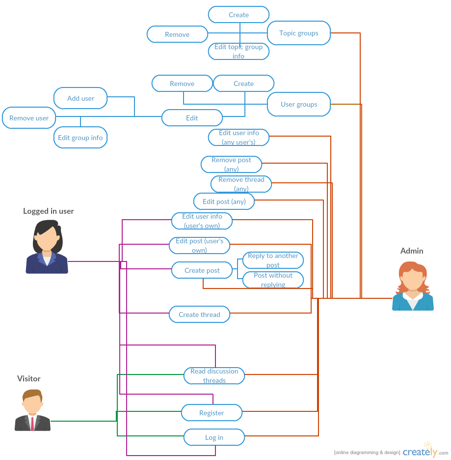

# Introduction

This app is for a discussion forum database application, written with PHP using PostgreSQL as the database. The application runs at the users.cs.helsinki.fi server of the Department of Computer science of University of Helsinki.

# Project description

The key function of the forum is to have discussion threads that can contain multiple posts. Any non logged in user (from now on referring to them as 'visitors' in this document) can read any of these threads and posts and also register and log in. Logged in users can also create new threads and posts. Users can edit their own posts and see and edit their user info. Posts can be replies to another post. Users can also see each other's user info.

Admin users can remove and edit posts made by anyone. They can also delete threads completely and edit user info of any user. Besides that, they can also handle various functions related to groups - create, remove and edit them. By editing a group, they can change the group info and add and remove users.

# Use cases

_Done with [creatly](http://creately.com/)_
